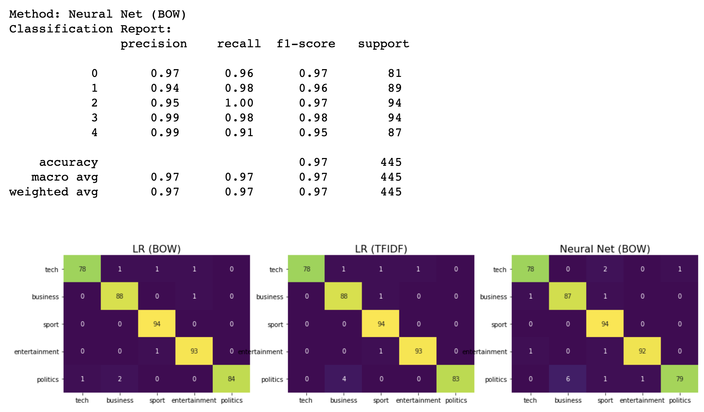

# BBC News Classification using Natural Language Processing

- Data downloaded from https://storage.googleapis.com/laurencemoroney-blog.appspot.com/bbc-text.csv

# Method of analysis

## Data Processing

- Bag of words (BOW) method
- TFIDF method

## Models
- Logistic Regression (LR)
- Deep Neural Network (DNN)

## Results

